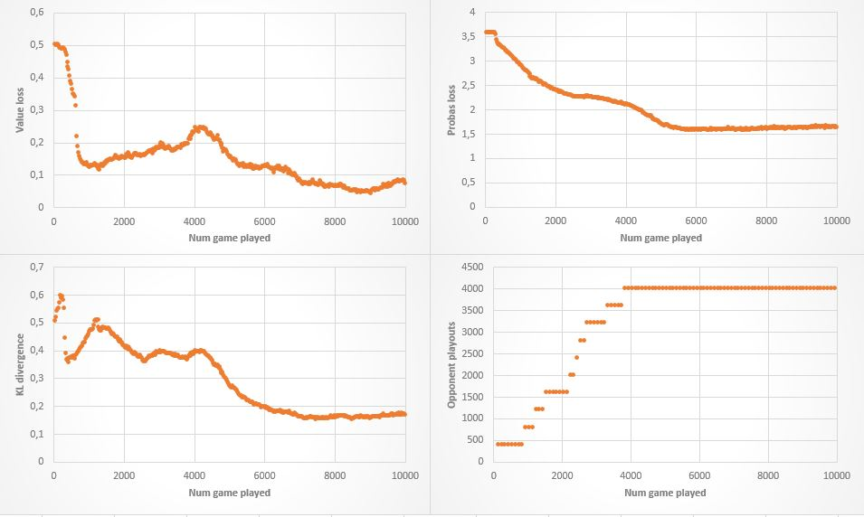

# Caffe_AlphaZero: A Caffe/C++ implementation of [Deepmind's AlphaZero Algorithm used to learn Go, Chess and Shogi](https://arxiv.org/abs/1712.01815)

This is my implementation of AlphaZero algorithm with Caffe. I tried to follow as much as possible the paper. Differences with my code are listed in section [Differences](#diff).
The core algorithm is templated and separated from the specific game rules (AlphaZero folder), so this code could theoretically be trained on any game (like Go or Chess). However, as I am far from having enough computing power, only two simple games are implemented as examples: Tic Tac Toe and Connect Four, both with variable size boards.

## Dependencies

This code relies on [Caffe main branch](https://github.com/BVLC/caffe).

Boost is also used, but you should already have it installed if you have Caffe.

I have only tested this code on Windows with Visual Studio 2013 and 2015, but it should also be able to run on Linux and Mac Os provided that Caffe is correctly installed.

## Building

The project uses CMake as a building tool.
Once you have correctly built and compiled the code, you should be able to launch the program for both training and testing.

## Testing

There are five testing modes available:
* Human test: N games between the algorithm and the user
* Self test: N games in which the algorithm plays both players
* Compare test: N games played between two models to determine which one is the best
* MCTS test: N games played against a MCTS algorithm using random playouts and uniform probability policy instead of neural network evaluation
* Random test: The opponent is a random player

An example of a command line used to perform tests can be found in `launch_files/test_tic_tac.bat` as well as a trained model for Tic Tac Toe game on a 6x6 board. This training was made without batch normalization layers because I found out that they slow down the training process and do not help improving performances very much (at least for these games).

## Training

An example of a command line used to train a network can be found in `launch_files/train_tic_tac.bat`. The training process can be stopped and restarted at any time using .solverstate files. However, the memory buffer is not saved and has to be filled again.

These are the loss I obtained when training a network with 2 residual blocks.

## Implementing a new game

To train the algorithm on a new game, you just have to create a YourGameState.h file describing the rules (following the `AlphaZero/GenericState.h` example) and a main.cpp file to launch the training. You should be able to follow the sections [Training](#training) and [Testing](#testing) once your game is compiled.

## Differences with the original paper

This implementation differs from Deepmind's explanations in (at least) these points:
* As the implemented games are much simpler than Go or Chess, the network's architecture is lighter, having only one or two residual blocks instead of 40 in the paper and 64 output channels instead of 256 for the convolution layers
* ReLU layers are replaced with leaky ReLU
* MCTS is not parallelized
* During testing the first action is selected randomly to ensure a bit of diversity in the games
* During self-playing the temperature is always set to 1 (in the paper it is set to 1 only for the 30 first moves and then set to 0)

## TODO

- [ ] Add a Elo-like rating system to monitor training improvement
- [x] Separate self-playing and training in two threads running asynchronously (for example two separated networks with periodic updates) <-- In fact it did not speed up the process as the threads are waiting for the GPU to be available (see [https://github.com/BVLC/caffe/issues/5855](https://github.com/BVLC/caffe/issues/5855))
- [x] Add the possibility to use symmetry
- [ ] Parallelize MCTS and perform evaluation in batch
- [x] Add time limit instead of iteration limit when using MCTS for testing <--Set in the MCTS class, not called from the main file for now
- [ ] Save memory buffer when the training process is stopped

## License

GNU AGPLv3